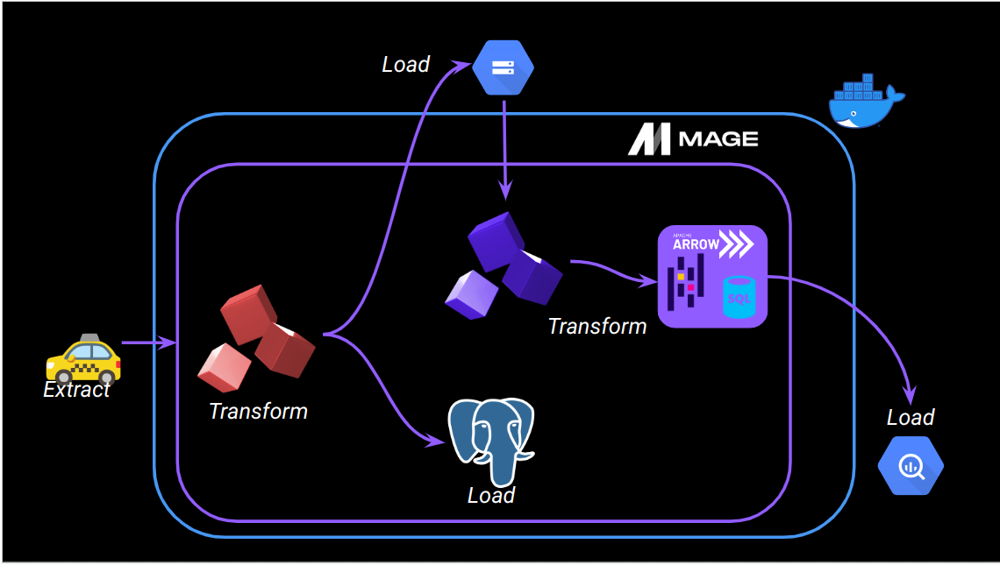

## Data Engineering Zoomcamp - Week 2

In this module, I learnt how to use the Mage platform to author and share data pipelines. 

Mage is an open-source, hybrid framework for transforming and integrating data. ✨

<div>

</div>

- [`magic-zoomcamp`](magic-zoomcamp) - the Mage project with ETL pipelines created during classes and as a part of the homework
- [`homework-2.md`](homework_2.md) - the homework quiz



## Preparation

This folder contains a Docker Compose template for getting started with a new Mage project. It requires Docker to be installed locally. 

### Credentials

`dev.env`  is a template for credentials. It should be renamed to `.env`— to _ensure_ it is not committed to Git by accident, since it _will_ contain credentials in the future.

To rename the project, change the varable `PROJECT_NAME` in the `.env` file.

### Build the container

```bash
docker compose build
```

### Start the Docker container:

```bash
docker compose up
```

### Mage interface

Navigate to http://localhost:6789 in the browser.

## Repository structure

```
.
├── mage_data
│   └── magic-zoomcamp
├── magic-zoomcamp
│   ├── __pycache__
│   ├── charts
│   ├── custom
│   ├── data_exporters
│   ├── data_loaders
│   ├── dbt
│   ├── extensions
│   ├── interactions
│   ├── pipelines
│   ├── scratchpads
│   ├── transformers
│   ├── utils
│   ├── __init__.py
│   ├── io_config.yaml
│   ├── metadata.yaml
│   └── requirements.txt
├── Dockerfile
├── README.md
├── dev.env
├── docker-compose.yml
└── requirements.txt
```

## Resources

- [Mage documentation](https://docs.mage.ai/introduction/overview)
- [Mage Slack](https://www.mage.ai/chat)
- [Docker installation instructions](https://docs.docker.com/get-docker/)
- [DTC Zoomcamp](https://github.com/DataTalksClub/data-engineering-zoomcamp/tree/main/week_2_workflow_orchestration)
- [Get Started with Mage - DTC Zoomcamp](https://github.com/mage-ai/mage-zoomcamp?tab=readme-ov-file#lets-get-started)
- [Mage GitHub](https://github.com/mage-ai/mage-ai): a good place to open issues or feature requests
