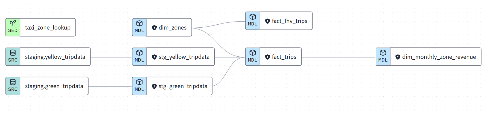

# Data Engineering Zoomcamp 2024 - Module 4 Homework

In this homework, we extended the models developed in the dbt project during the week 4 to include the data for fhv vehicles in our DWH.

[Datasets list](https://github.com/DataTalksClub/nyc-tlc-data/)
* Yellow taxi data - Years 2019 and 2020
* Green taxi data - Years 2019 and 2020
* fhv data - Year 2019.

The data were used to:
* Build a source table: `stg_fhv_tripdata`
* Build a fact table: `fact_fhv_trips`
* Create a dashboard

Lineage graph:


 
### Question 1:

**What happens when we execute dbt build --vars '{'is_test_run':'true'}'**
You'll need to have completed the ["Build the first dbt models"](https://www.youtube.com/watch?v=UVI30Vxzd6c) video.

- It's the same as running _dbt build_
- It applies a _limit 100_ to all of our models
- It applies a _limit 100_ only to our staging models
- Nothing

**Answer**: It applies a _limit 100_ only to our staging models

### Question 2:

**What is the code that our CI job will run? Where is this code coming from?**  

- The code that has been merged into the main branch
- The code that is behind the creation object on the `dbt_cloud_pr_` schema
- The code from any development branch that has been opened based on main
- The code from the development branch we are requesting to merge to main

**Answer**: The code from the development branch we are requesting to merge to main

### Question 3 (2 points)

**What is the count of records in the model fact_fhv_trips after running all dependencies with the test run variable disabled (:false)?**  
Create a staging model for the fhv data, similar to the ones made for yellow and green data. Add an additional filter for keeping only records with pickup time in year 2019.
Do not add a deduplication step. Run this models without limits (is_test_run: false).

Create a core model similar to fact trips, but selecting from stg_fhv_tripdata and joining with dim_zones.
Similar to what we've done in fact_trips, keep only records with known pickup and dropoff locations entries for pickup and dropoff locations.
Run the dbt model without limits (is_test_run: false).

- 12998722
- 22998722
- 32998722
- 42998722

**Answer**: 22998722 (see solution below)
### Question 4 (2 points)

**What is the service that had the most rides during the month of July 2019 month with the biggest amount of rides after building a tile for the fact_fhv_trips table?**

Create a dashboard with some tiles that you find interesting to explore the data. One tile should show the amount of trips per month, as done in the videos for fact_trips, including the fact_fhv_trips data.

- FHV
- Green
- Yellow
- FHV and Green

**Answer**: Yellow (see solution below)

## Homework Solution

### Upploading data to GCS

For uploading green and yellow taxi data for 2019-2020, to GCS I modified `web_to_gcs.py` (from [[dezoomcamp-2024-module-3|Module 3: Data Warehouse]] extras).

- Install necessary packages (pandas, pyarrow, google-cloud-storage)
- Set GOOGLE_APPLICATION_CREDENTIALS to the project/service-account key. Set GCP_GCS_BUCKET as your bucket.
- Run `web_to_gcs.py`. The modified version of the script accounts for data types while reading gzipped csv files from the New-York taxi data in the course repository.

### Creating tables in BigQuery

I created external tables in BigQuery and materialised them using the adapted SQL scripts from [[dezoomcamp-2024-module-3|Module 3: Data Warehouse]]

### Setting up the dbt project

In BigQuery
- Create a service account credentials (or use the earlier created .json)
In GitHub
- Create an empty GitHub repo
In dbt
- Create a new dbt project
- Set up the connection of dbt to BigQuery (create and upload a json key)
- Connect dbt to your GitHub account (it is possible to restrict access to this particular repo)
- View an ssh key that was automatically generated in dbt for this project and add it to your GitHub repo
- In dbt Cloud initialise a new project in the `main` branch. The project will be automatically populated with a template project.
- To be able to make changes, create a new branch `dev` (either using dbt Cloud interface or GitHub).

### Creating models

For green and yellow taxi data I followed the course videos

For fhv data:
- Add fhv_tripdata to the sources
- Create a stg_fhv_tripdata.sql model
- Add the fields from the table to the schema
- Create a primary key and tests for uniqueness and not being null
- build the model

Answers to the assignment questions are in the Assignment section

### Solution to question 3

**What is the count of records in the model fact_fhv_trips after running all dependencies with the test run variable disabled (:false)?**  

```sql
select count(*) from {{ ref("fact_fhv_trips") }}
```

### Solution to question 4

**What is the service that had the most rides during the month of July 2019 month with the biggest amount of rides after building a tile for the fact_fhv_trips table?**

```sql
with
    green_and_yellow_data as (
        select service_type, count(*) as total_records
        from {{ ref("fact_trips") }}
        where
            extract(year from pickup_datetime) = 2019
            and extract(month from pickup_datetime) = 7
        group by 1
    ),
    fhv_data as (
        select service_type, count(*) as total_records
        from {{ ref("fact_fhv_trips") }}
        where
            extract(year from pickup_datetime) = 2019
            and extract(month from pickup_datetime) = 7
        group by 1
    )

select *
from green_and_yellow_data
union all
select *
from fhv_data
```
